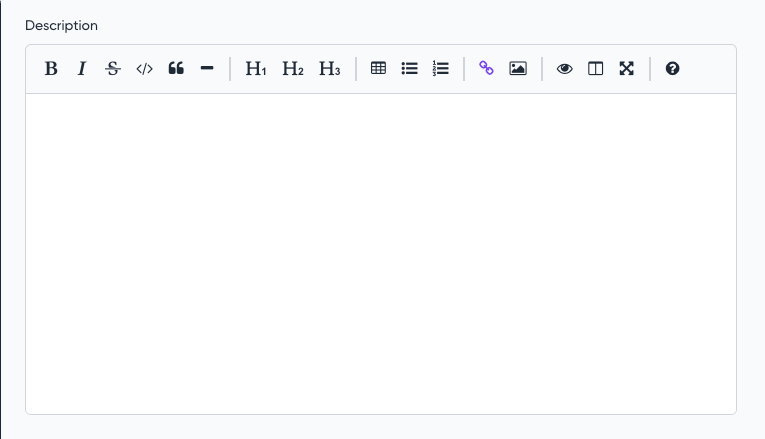

# Markdown field for [MoonShine Laravel admin panel](https://moonshine-laravel.com)

Extends [Textarea](https://moonshine-laravel.com/docs/resource/fields/fields-textarea) and has the same features

<picture>
    <source media="(prefers-color-scheme: dark)" srcset="./art/markdown_dark.png">
    <source media="(prefers-color-scheme: light)" srcset="./art/markdown.png">
    
</picture>

---

## Compatibility

|      MoonShine       | Moonshine EasyMDE | Currently supported |
|:--------------------:|:-----------------:|:-------------------:|
|       >= v3.0        |     >= v1.0.0     |         yes         |

## Installation
```shell
composer require moonshine/easymde
```

## Usage

```php
use MoonShine\EasyMde\Fields\Markdown;

// ...

Markdown::make('Description')
```

## Default config

`Markdown` field uses the most common settings such as plugins, menubar and toolbar by default

To change the default settings, you need to publish the configuration file:

```php
php artisan vendor:publish --tag="moonshine-easymde-config"
```

You can also add additional options to the configuration file that will apply to all `Markdown` fields

```php
'previewClass' => ['prose', 'dark:prose-invert'],
'forceSync' => true,
'spellChecker' => false,
'status' => false,
'toolbar' => [
    'bold', 'italic', 'strikethrough', 'code', 'quote', 'horizontal-rule', '|', 'heading-1',
    'heading-2', 'heading-3', '|', 'table', 'unordered-list', 'ordered-list', '|', 'link', 'image', '|',
    'preview', 'side-by-side', 'fullscreen', '|', 'guide',
],
```

## Toolbar

The `toolbar()` method allows you to completely override toolbar for a field

```php
toolbar(string|bool|array $toolbar)
```
```php
Markdown::make('Description')
    ->toolbar(['bold', 'italic', 'strikethrough', 'code', 'quote', 'horizontal-rule'])
```

## Options

The `addOption()` method allows you to add additional options for a field

```php
addOption(string $name, string|int|float|bool|array $value)
```
```php
Markdown::make('Description')
    ->addOption('toolbar', ['bold', 'italic', 'strikethrough', 'code', 'quote', 'horizontal-rule'])

```
